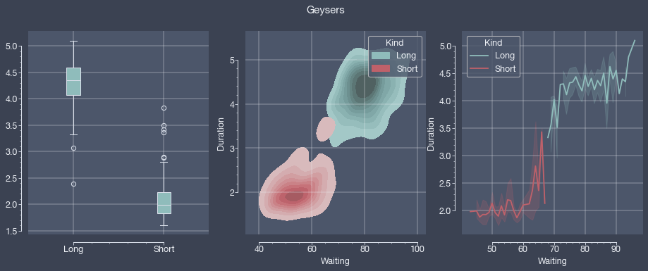
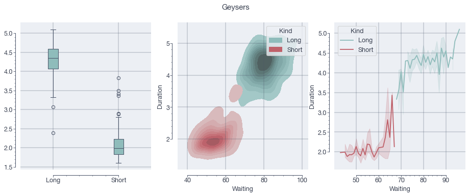
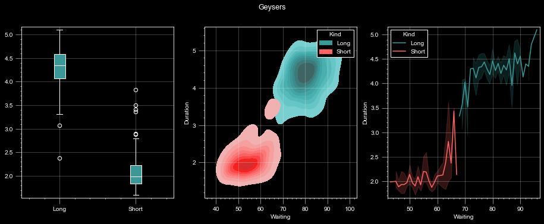
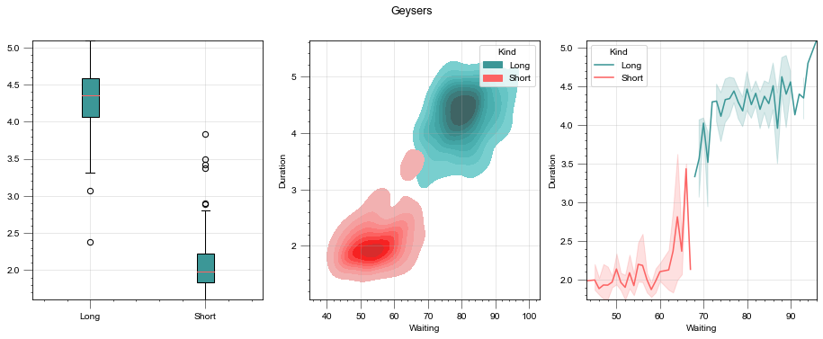
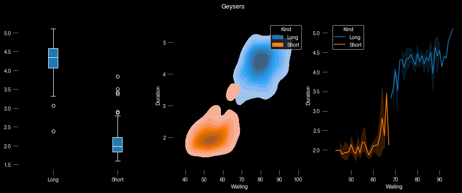
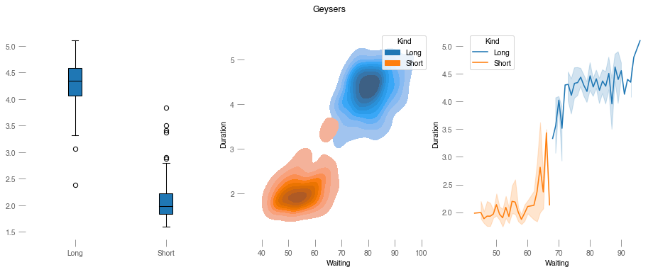
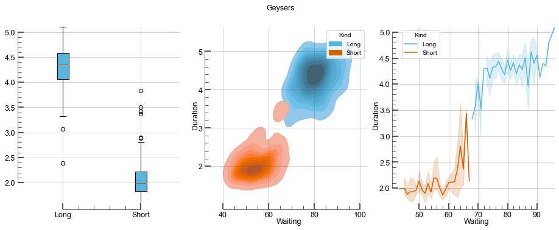
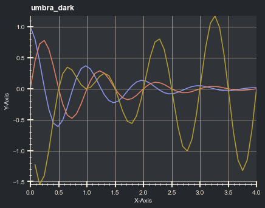
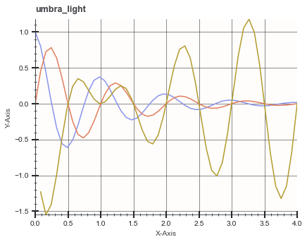

# Aquarel 🎨 

 

Aquarel is a lightweight templating engine and wrapper around Matplotlibs' `rcparams` to make styling plots simple.
Aquarel templates can be defined programmatically and be serialized and shared in a JSON format.

## Installation

Install via pip: `pip install aquarel`

## Usage

###### Applying a style
Styles can be either applied globally

```python
from aquarel import load_theme

theme = load_theme("arctic_light")
theme.apply()
# ... plotting code here
theme.apply_transforms()
```
...or with a context manager:
```python
from aquarel import load_theme

with load_theme("arctic_light"):
    figure = # ... plotting code here
```

###### Transforms
Themes may specify *transforms*. Transforms are functions applied on the finished plot to achieve aesthetics that are not possibly by means of `rcparams` only.
For example, to trim the axes, one could apply the `trim` transform:
```python
from aquarel import load_theme

with load_theme("arctic_light").set_transforms(trim=True):
    figure = # ... plotting code here
    
# plt.show() or savefig() have to be called outside the context manager to have the transforms correctly applied.
figure.savefig()
```
However, there is one important thing to keep in mind: since transforms require the matplotlib figure/axes object to be present and finished, they have to be applied **after** the plotting code.
When using a theme with a context manager, this is automatically done in the `__exit__` call. If global usage is desired, `Theme.apply_transforms()` has to be called after every figure.
This also means that calls that make use of the finished figure, i.e. `plt.show` or `plt.savefig` have to commence after transform application, so **outside** the context manager.

###### Customization & Theme Creation

Besides loading a predefined theme, you can create a new theme
```python
from aquarel import Theme

theme = (
    Theme(name="demo", description="A demo theme.")
    .set_grid(draw=True, width=0.5)
    .set_font(family="monospace")
    .set_color(grid_color="blue")
)
```
...modify an existing one
```python
from aquarel import load_theme

theme = (
    load_theme("arctic_light")
    .set_grid(width=2)
)
```
...and write and load your custom styles to and from disk:
```python
from aquarel import Theme

theme = Theme.from_file("custom.json")
theme.save("custom.json")
```

If the simplified API of aquarel is not sufficient for your use-case, you can also directly modify the underlying `rcparams` with overrides:
```python
from aquarel import load_theme

theme = load_theme("arctic_light").set_overrides({
    "ytick.minor.visible": False,
    "xtick.minor.visible": True
})
```

## Themes

aquarel ships with several pre-defined themes that are designed to showcase its templating capabilities. 
Add your own with a pull request!

| Name            | Description                                                                                      | Preview                       |
|:----------------|:-------------------------------------------------------------------------------------------------|:------------------------------|
| `arctic_dark`   | Frosty dark theme based on the  [nord](https://github.com/arcticicestudio/nord) color scheme     |    |
| `arctic_light`  | Frosty dark theme based on the  [nord](https://github.com/arcticicestudio/nord) color scheme     |   |
| `boxy_dark`     | Dark theme with enclosing box and grid                                                           |      |
| `boxy_light`    | Light theme with enclosing box and grid                                                          |     |
| `minimal_dark`  | Dark theme with minimal visual elements                                                          |   |
| `minimal_light` | Light theme with minimal visual elements                                                         |  |
| `scientific`    | Space-efficient and color-blind friendly theme for printing on paper                             |     |
| `umbra_dark`    | Balanced dark theme based on the [penumbra](https://github.com/nealmckee/penumbra) color scheme  |     |
| `umbra_light`   | Balanced light theme based on the [penumbra](https://github.com/nealmckee/penumbra) color scheme |    |
